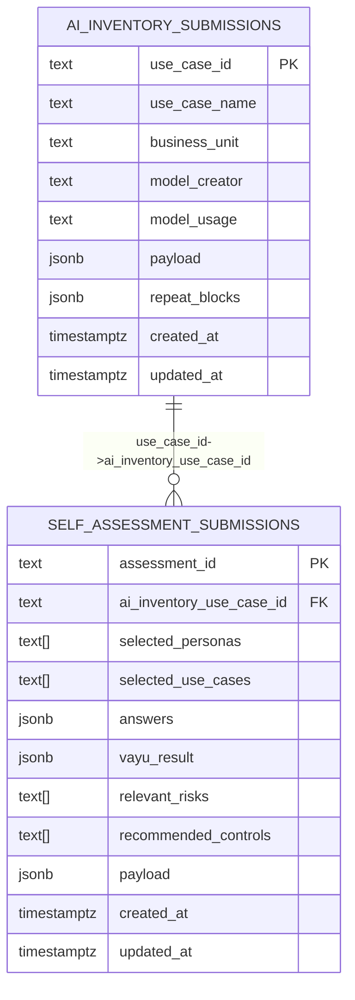

# PostgreSQL ER Diagram

```mermaid
erDiagram
  AI_INVENTORY_SUBMISSIONS {
    text use_case_id PK
    text use_case_name
    text business_unit
    text model_creator
    text model_usage
    jsonb payload
    jsonb repeat_blocks
    timestamptz created_at
    timestamptz updated_at
  }
  SELF_ASSESSMENT_SUBMISSIONS {
    text assessment_id PK
    text ai_inventory_use_case_id FK
    text[] selected_personas
    text[] selected_use_cases
    jsonb answers
    jsonb vayu_result
    text[] relevant_risks
    text[] recommended_controls
    jsonb payload
    timestamptz created_at
    timestamptz updated_at
  }
  AI_INVENTORY_SUBMISSIONS ||--o{ SELF_ASSESSMENT_SUBMISSIONS : "use_case_id->ai_inventory_use_case_id"
```
